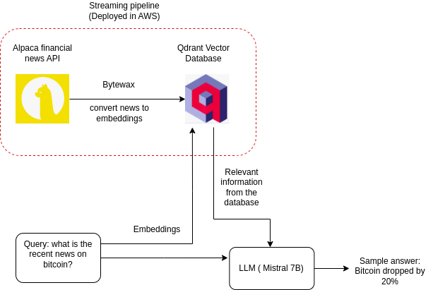

### Real-time RAG on financial news

1. Streaming pipeline: Gets upto date finance information from Alpaca API, creates embeddings and stores in Qdrant vector database. This streaming pipeline is based on the implementation from: https://medium.com/decodingml/the-llms-kit-build-a-production-ready-real-time-financial-advisor-system-using-streaming-ffdcb2b50714

- Uses poetry for dependency management
- Wrapped in a docker container
- Deployed in AWS ( Pushed docker image to AWS ECR and inference performed with EC2 instance)

2. Inference pipeline: Take queries from the user and get the relevant context from the Qdrant vector database. Uses Mistral 7B model to give answers based on the context extracted.
   

   - Uses Langchain for orchestration
   - Uses AWS Bedrock for using LLM models 
   - Uses FastAPI for inference